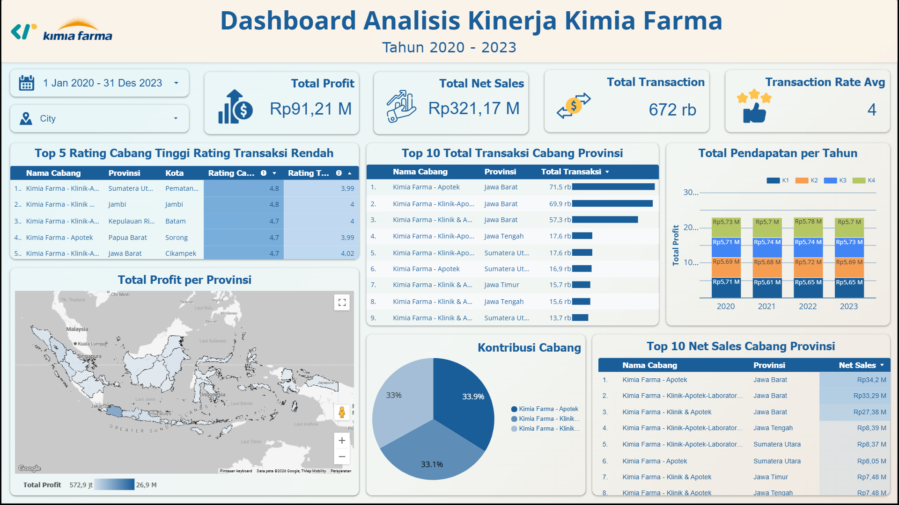

# kimia-farma-performance-analytics
Business Performance Analytics of Kimia Farma (2020–2023) using BigQuery, SQL, and Looker Studio.

## 📌 Project Overview
This project was developed as the final submission for the **Big Data Analytics Project-Based Internship** by **Rakamin Academy** in collaboration with **Kimia Farma**. The project focuses on analyzing Kimia Farma's business performance from **2020 to 2023** by transforming transactional data into an analytical table using **Google BigQuery**, followed by interactive dashboard development in **Looker Studio**. The dashboard provides business insights to support data-driven decision making.

## 🎯 Business Objectives
- Analyze Kimia Farma's business performance during 2020–2023.
- Identify sales and profit trends.
- Identify top-performing provinces and branches.
- Build an interactive dashboard for business monitoring.
- Generate business insights and strategic recommendations.

## 📂 Dataset
The analysis uses four datasets provided by Kimia Farma.
1. kf_final_transaction = Transaction data
2. kf_product = Product master
3. kf_kantor_cabang = Branch master
4. kf_inventory = Inventory data

## 🔄 Project Workflow
1. CSV Dataset
2. Google BigQuery
3. Data Quality Check
4. Create Analytical Table
5. Looker Studio Dashboard
6. Business Insights
7. Business Recommendations

## 📊 Dashboard Preview

  

View Dashboard Interactive : https://datastudio.google.com/reporting/a82a5004-5168-4f15-98d0-2d8c0fee3437/page/p_dln022v94d

## 💡 Key Insights
- Business performance remained stable throughout 2020–2023.
- D.I. Yogyakarta recorded the highest Net Sales and total transactions.
- Branch ratings were consistently high, while transaction ratings indicated opportunities for service improvement.
- Sales contributions were relatively balanced across branch categories.

## 🚀 Business Recommendations
- Maintain the performance of top-performing regions.
- Improve customer transaction experience.
- Use high-performing branches as operational benchmarks.
- Optimize sales strategies in lower-performing regions.

## 👤 Author
**Berka Ridha Rahmainingtias**, Big Data Analytics Project-Based Internship, Rakamin Academy × Kimia Farma

## ✨ Skills Demonstrated

- SQL Query
- Data Cleaning & Validation
- Data Transformation
- Data Modeling
- Data Visualization
- Business Analysis
- Dashboard Development
- Insight Generation
- Business Recommendation
